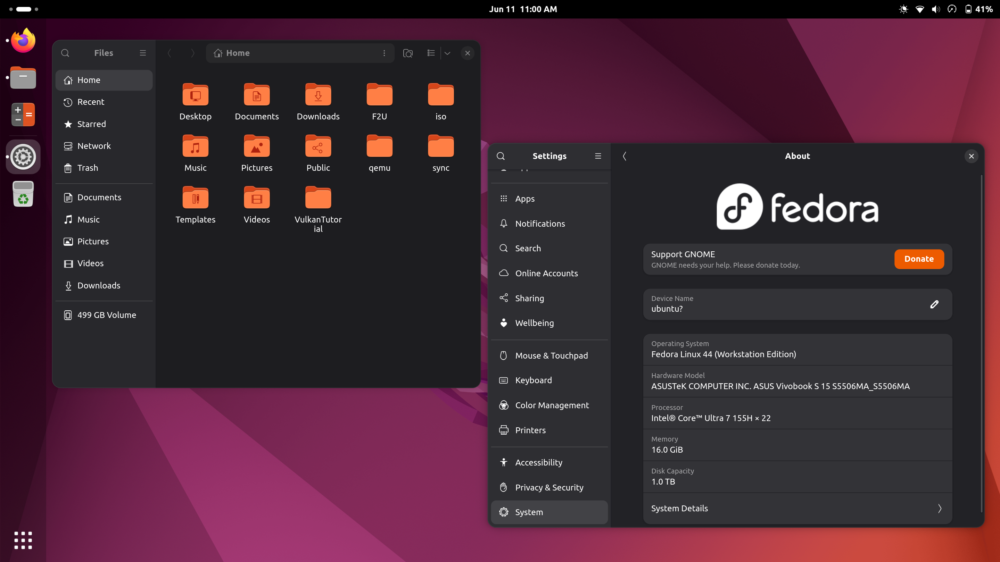
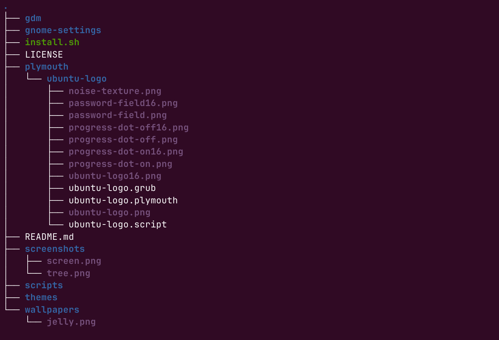

# Fedora 44 to Ubuntu theme setup

A small script to transform the Fedora workstation theme into Ubuntu LTS.



## ✨ Features
- Theme **Yaru Dark** (GTK3/GTK4 + Shell)
- Yaru Icons (light/dark) "Default Dark" 
- Ubuntu Dock (Dash-to-Dock)
- Ubuntu Wallpapers optional (work in progress)
- Accent Color orange
- Plymouth Support (Ubuntu theme)
- Automated Script

---

## 📦 Requirements
- Fedora 44
- Gnome 50
- Internet Connection (dnf packages)
- sudo privilages

## 🚀 Installatione
```bash
git clone https://github.com/Matteo7034/F2U.git
cd F2U
sudo ./install.sh
```
## 🧩 What the script does
- Automatically install Yaru themes

- Enable and configure Dash-to-Dock

- Set GTK, Shell, and icon themes

- Apply orange accent color

- (Optional) Set Ubuntu wallpaper

-  Install Plymouth Ubuntu theme

## 📁 Project structure


## 🛠  Uninstall
(In development)
The uninstall.sh script will restore Fedora's original themes and settings. 

## 📜  Licenza

This project is licensed under the GPL‑2.0 license.
